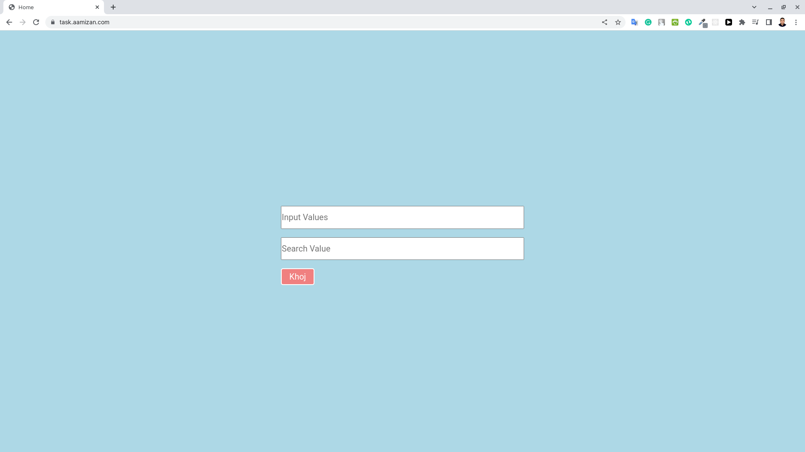
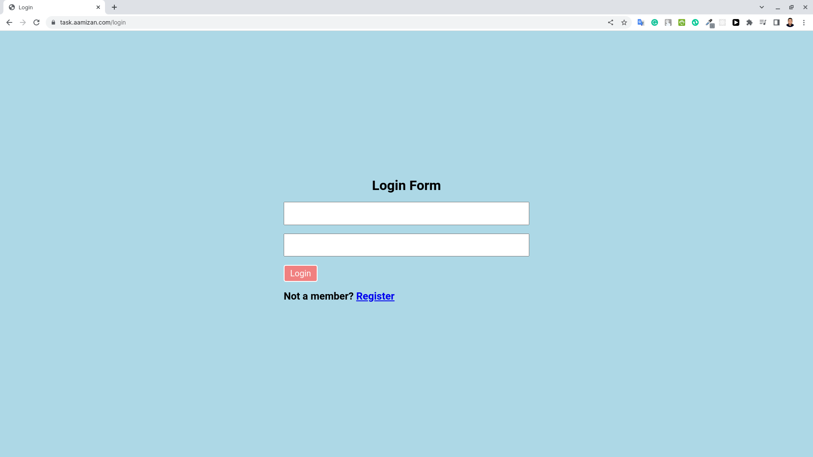
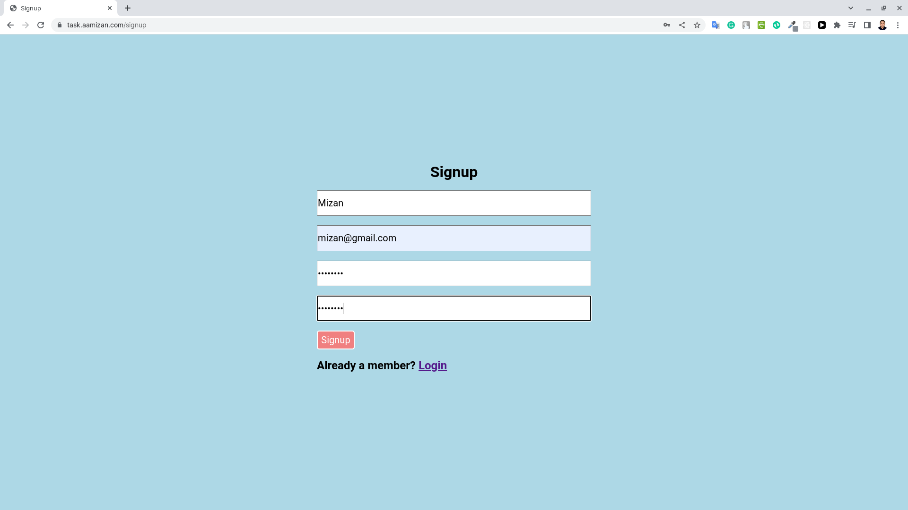
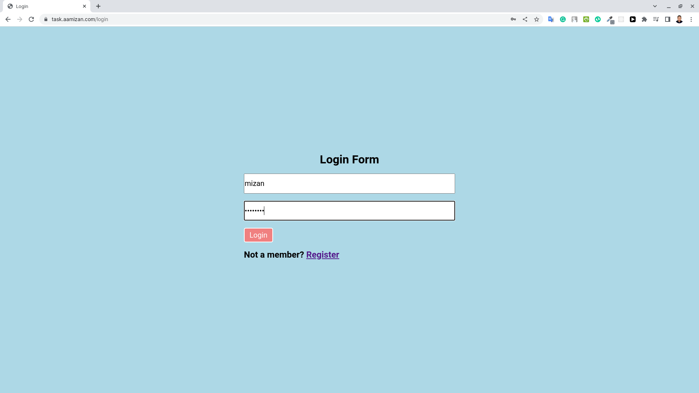
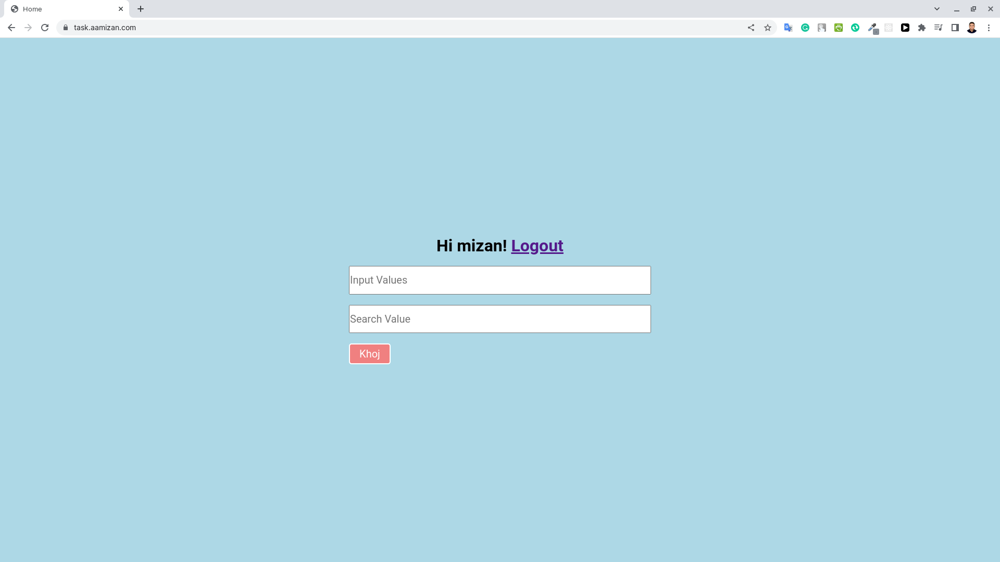
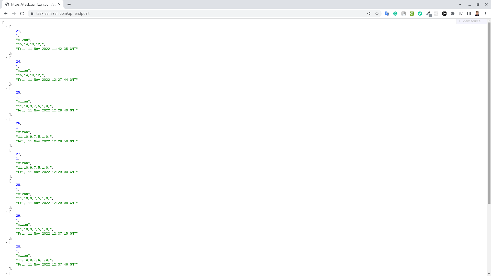

# Evident Task
<h2>Link:</h2>https://task.aamizan.com/

<h1>Tools and Technology</h1>
For frontend design i use css flexblox and media query.
 
For backend devlopment i use Flask.i think for this type of small project flask microframework is better than other powerfull framework like djando
 
For databass i use flask_mysqldb module.i can do this with flask orm like flask sqlalchemy but i use flask_mysqldb and i connect databass with basic sql query.and i use mysql because i want to host it on my cpanel.

<h1>How to use it</h1> 
git clone 
 
cd evident_bd_task
 
pip install flask
 
pip install flask_mysqldb
 

<h1>Databass setup</h1>
open mysql databass
 
import evident.sql
 
update app.py file databass
 
databass name

your app is ready 
go to 127.0.0.1:5000

<h1>How The app work!</h1>

<h4>first open the home page</h4>
 

 
<h4>if you are not login.home page redirect you to login page.<h4>
 
  

  
 
<h4>if you are not register you have to go sign up pageand fill the form with proper data.<h4>
 
  

  
 
<h4>then go to login page and login <h4>
 
  

  
 
<h4>now you can see result<h4>
 
  

  
 
<h4>go to 127.0.0.1:5000/api_endpoint to view the api<h4>
 
  

